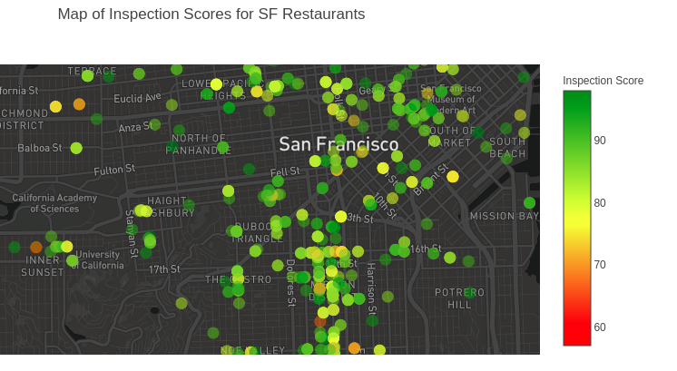

# Restaurant-Inspection-Analysis
**Project:** 

This project analyzed San Fransisco Restaurant Inspection Data using Python code and Plotly Dash to displayed an interactive map. 

The inspiration behind the project was from my favorite restaurants on Yelp. With access to health department's inspection reports and scoring system on restaurants, I was curious to see what could be found within the data. The inspections were unscheduled. After an inspection occurred, the health inspectors calculates a score based on the violations observed. Violations fell into high, moderate, and low risk categories. High risk category records specific violations that directly relate to the transmission of food-borne illnesses, the adulteration of food products and the contamination of food-contact surfaces. Moderate risk category records specific violations that are of a moderate risk to the public health and safety Low risk category records violations that are low risk or have no immediate risk to the public health and safety. When a score is given, the inspector issues a score card and remains at the food establishment. This score is available for the public.

**Results:**
The analysis revealed restaurants with a high risk category could also score high for their inspection score. I thought this to be very interesting. The public should be aware of the risk category, not just the inspection score. A high risk category restaurant is a deciding facting if I will be a patron.   

**Image of Plotly Dash Application:**

**Application link:**

Hosted on Digital Ocean

http://192.81.212.201:1872/

